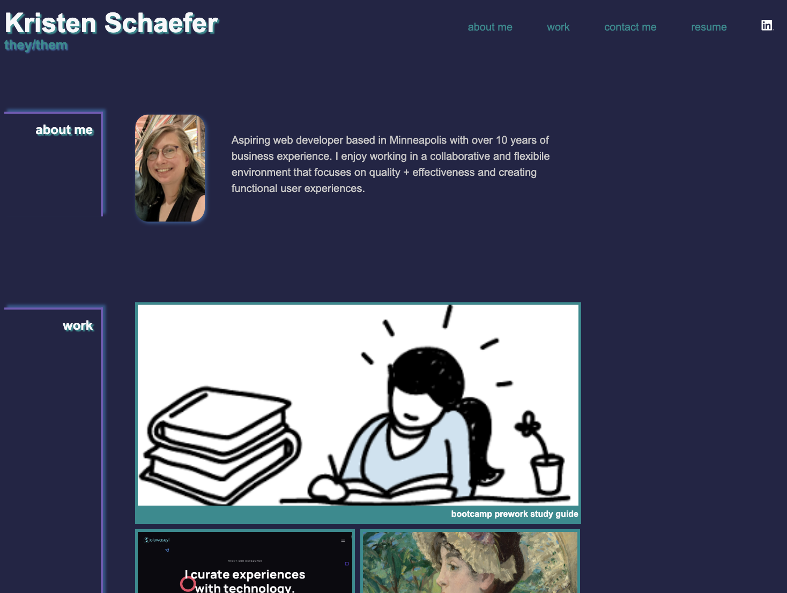

# Professional Portfolio for Job Candidate

[Click here to view final version of webpage](https://kcschaefs.github.io/pro-portfolio/)

## User Story
An employer wants to view a candidate's portfolio to determing the quality of their work and help determine their fit for the role. This is the candidate's portfolio.

## Tasks

- Create basic content structure in HTML
- Add images and included alt text for accessibility
- Add CSS styling to improve the look of the page
- Add nav links that scroll to the corresponding spot on the webpage
- Add nav links to resume, LinkedIn profile, and contact info to make it easier to view additional professional info about the candidate and contact them easier
- Add "project" cards to highlight my coding projects (I don't have many so most of these are just links to resource sites or things I enjoy)
- Added screen responsiveness and changed layout for mobile view
- Add CSS styling to highlight/emphasize user interaction
- Utilize GitHub for version control + code repo
- Deploy webpage through GitHub

## Learnings
- I learned and became much more familiar with CSS capabilities, mainly flexboxes
- How to nest flexboxes to get the desired layout
- How to review and test my code to remove uneccessary code
- I became much more comfortable with Git and GitHub
- How to utilize Google and Stack Overflow to troubleshoot issues with my code and styling

## Future Improvements
- Improving flexbox functionality to make it act in the ways that I want it to (mainly with grow and shrink)
- Fixing the nav links padding or margin to make sure the links don't move when hovered over